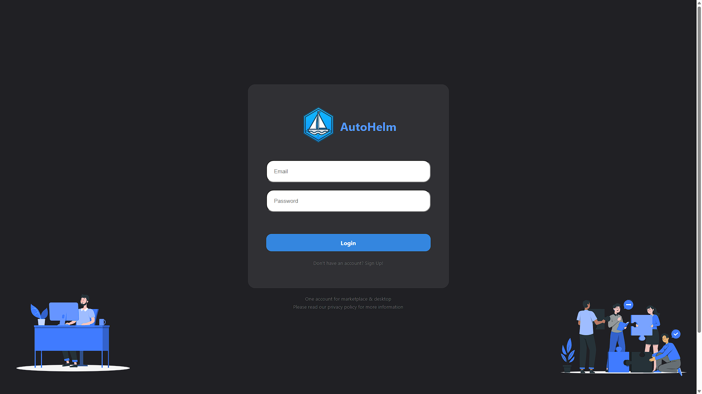

# Marketplace



## General setup
DONT USE WSL. It makes the run process much slower and doesn't have fast reload (reload on save). 
I recommend use git bash

install nodejs: https://nodejs.org/en

Install Express
```
npm install express
```
Install React Router Dom
```
npm install react-router-dom
```

Install react scrtips with:
```
npm install react-scripts --save
```

## Server
to start the server, type 
```
cd server
node . 
```
this will start on http://localhost:8800

## Client
to start client, type 
```
cd client
npm start
```
this will start on http://localhost:3000
